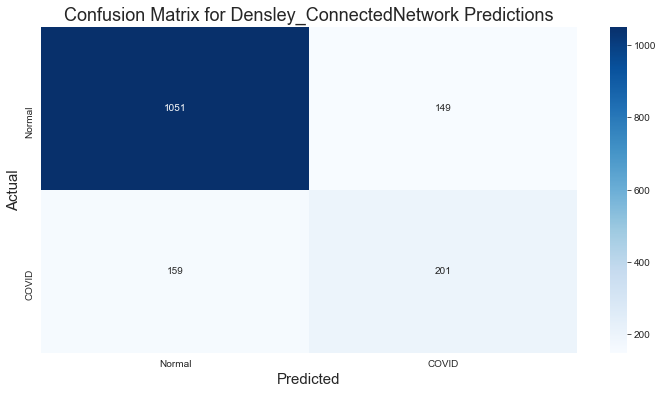
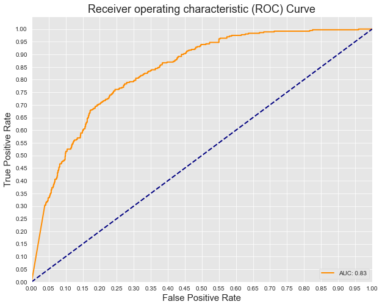
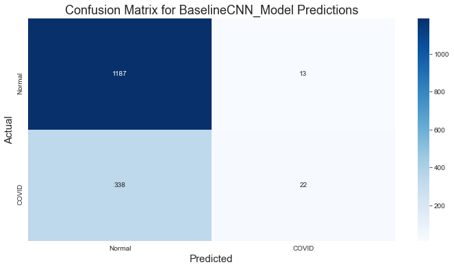
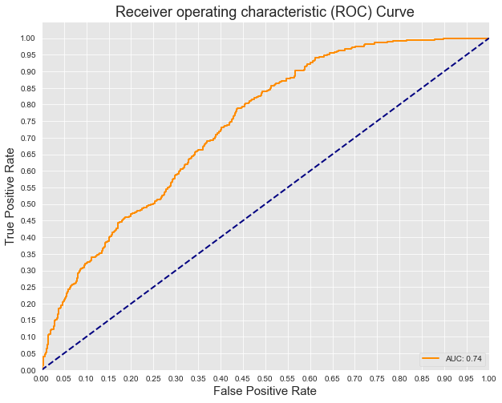
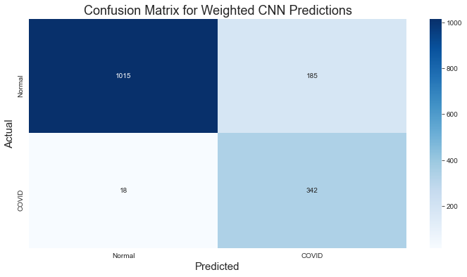
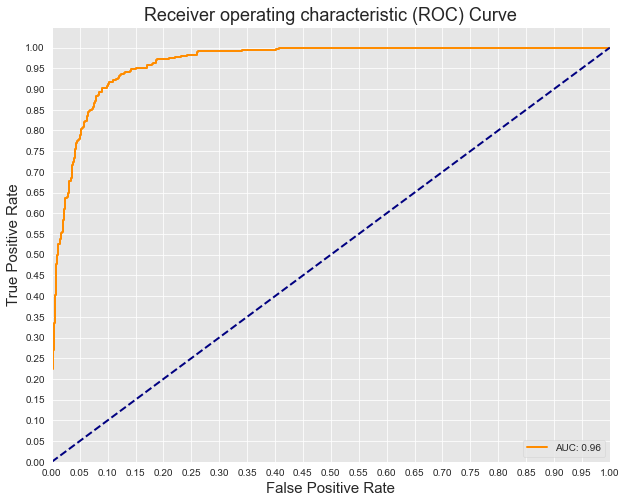

# COVID19_Detection_Project
**Authors**: [Ji Hoon Chung](mailto:jhj1650@gmail.com), [Kibae Kim](mailto:rlqo7376@gmail.com)

## Overview
Using data pulled out from Kaggle, we retrieved chest X-Ray of normal people & COVID-19 patients:<br>
Data Imported from = https://www.kaggle.com/donjon00/covid19-detection <br>
    *NORMAL IMAGES = 11,767 Images<br>
    *COVID-19 IMAGES = 3,616 Images
***
Coronavirus disease 2019 (COVID-19) is a contagious disease caused by severe acute respiratory syndrome coronavirus 2 (SARS-CoV-2). The disease has since spread worldwide, leading to an ongoing pandemic.
So, we built a deep learning model to detect people who infected to COVID-19 virus by using their lung X-ray data from Kaggle. This project will help hospitals figure out infected people when they don’t have COVID test kit.


## Business Problem
***
Hospitals are short with COVID-19 test kits, and they are looking for alternative ways to detect COVID-19 infection status.
We are looking to build a model which can detect COVID-19 just by looking at Chest X-ray images.


## Modeling
***
We've tried 3 different models to build COVID-19 classification project. <br>

1. Densely Connected Network Model <br>
<br>
<br>

2. Baseline CNN Model <br>
<br>
<br>

3. Weighted CNN Model <br>
<br>
<br>

## Conclusion
***

1. We chose weighted CNN model because this model detect COVID-19 well and also detect normal well.
2. Our weighted CNN model can be useful as a method of COVID-19 detection for hospitals when they don’t have test kit.


## Ideas for Improvement
***
1. See if the model can differentiate COVID X-ray images from other lung disease X-ray images such as pneumonia.
2. See if we can develop new models to detect other diseases using X-ray images.

## Repository Structure

***

```
├── README.md                                      <- The high-level overview of this project
├── COVID19_Detection_project_presentation.pdf     <- PDF version of project presentation
├── COVID19_Detection_Project.ipynb                <- Final_Notebook used for the project
├── images                                         <- Sourced externally and visualizations generated from code
├── data                                           <- All the Image data files used for the notebook.
```
